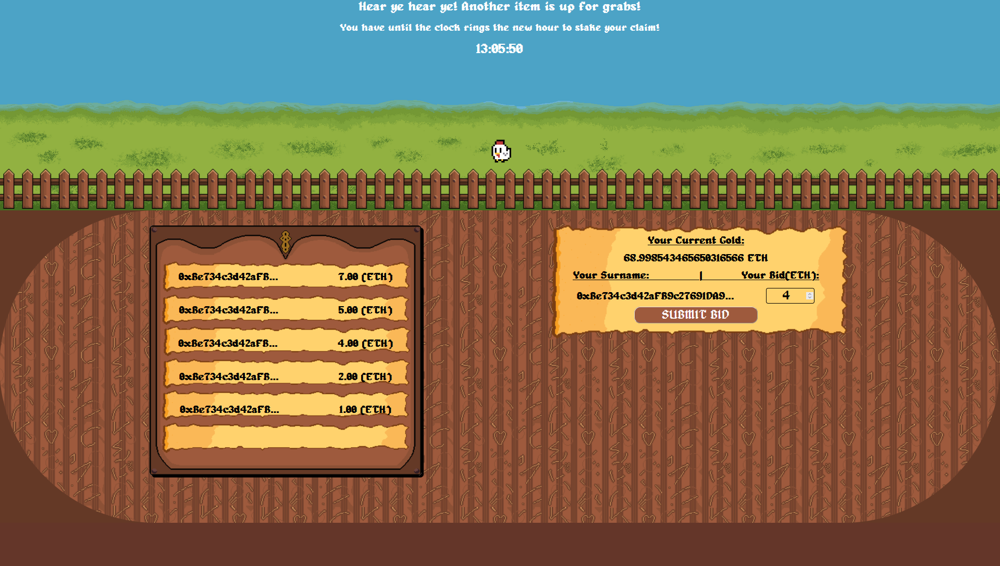

# Overview
### This project was originally created for my CS458, Blockchain Principles, and Applications, a class I took during the last semester of my senior year at Colorado State University. The project currently serves as a standalone NFT bidding platform in which I, the owner of said NFTs, play the role of the auctioneer. The goal of this project was to test my skills as a React.js developer and artist as well as try my hand at creating a Solidity smart Contract. 

### The eventual goal was to develop this bidding platform into a supplementary aspect of a larger game which would be called "Bidder, Faster, Stronger." Within this game, users would take on the role of an adventurer where they would face enemies in a side-scrolling, two-dimensional fashion. These enemies would have a chance to drop interesting items that influence the gameplay. These items, however, would be of varying rarities and sometimes would be so rare that it would take real-time days and even weeks for these items to "drop". To allow users a more reliable way to add these items to their inventory, the bidding platform would serve as a marketplace where these items occur with a slightly higher frequency.

## Testing

1. Open Ganache

2. deploy the Ganache server

3. generate testing addresses

4. Truffle migrate (deploys contract)

6. Copy the contract address into App.js

7. Currently there are some minor bugs with generateRandomNum, but this may be because I don't exactly remember the steps I took when I last looked at this project.

## Production deployment

1. if I were to deploy this on the blockchain (a very real possibility) I would need to mint all of the NFTs beforehand and find a secure way to transfer said NFTs.

2. Once the contract is deployed I would copy the smart contract's address into App.js

3. Create a production build of the web-app

4. Deploy the build using Firebase or some similar hosting service

5. create a script that securely allows only me to call functions from the smart contract and calls generateRandomNum once every hour on the hour.
